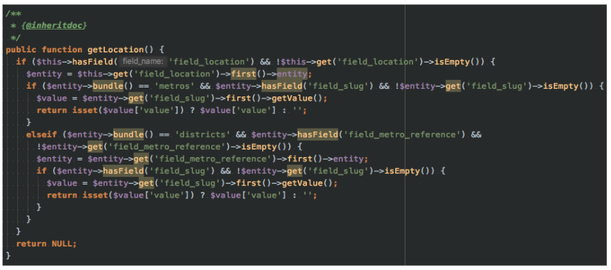
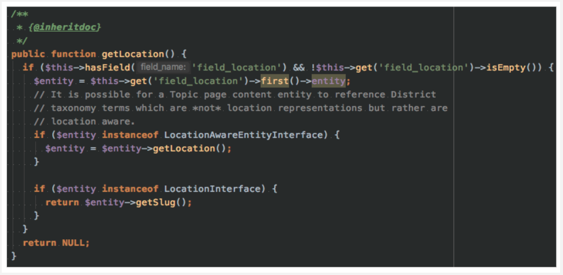

## Discoverable Entity Bundle Classes

Currently in Drupal 8, there is _no_ mechanism for deriving a base entity type's class implementation with a unique class type on a per-bundle basis. As a result, if overriding the entity type class, that class type will be used for all instances in which that entity is instantiated as.

This module is also referred to as "DEBC", short for "Discoverable Entity Bundle Classes".

### Installation & usage

##### Installation via Composer

This module should be installed through use of Composer.

```
$ composer require amcgowanca/discoverable_entity_bundle_classes:^1.0
```

##### Usage

Discoverable Entity Bundle Classes module does not provide any "out of the box" ready setup or configuration and is focused on enhancing the developer experience of building elegant solutions. As a result, the following is required:

1.  Ensure that the entity storage class for the entity type which you would like entity bundle classes made available for implements the trait `Drupal\discoverable_entity_bundle_classes\Storage\SqlContentEntityStorageTrait`. This trait's implementation is focused on ensuring that the needed `SqlContentEntityStorage` class methods from Drupal core are effectively overridden to allow for discoverable bundle classes and their instantiation.

    Note that this module provides the required Storage class representations for Drupal core's Node, Comment and Taxonomy term entities but does not activate them. _This_ is purposefully left for the technical architect of the implementing project to decide. See  #2 below.

2.  If the entity type (e.g. Node) is being provided via a Drupal core or contributed module package, ensure that a storage class exists or is made available that implements the required `SqlContentEntityStorageTrait` trait. Override the entity type's storage class through use of `hook_entity_type_alter(&$entity_types)`.

    ```php
    /**
     * Implements hook_entity_type_alter(&$entity_types)
     */
    function my_module_entity_type_alter(&$entity_types) {
      /** @var \Drupal\Core\Entity\EntityTypeInterface[] $entity_types */
      if (isset($entity_types['node'])) {
        $entity_types['node']->setStorageClass('\Drupal\discoverable_entity_bundle_classes\Storage\Node\NodeStorage`);
      }
    }
    ```

3.  Define custom entity bundle classes (e.g. Article) which extends the previously defined base entity class. For example, if Article is a type of Node, then it should be defined as:

    ```php
    namespace Drupal\my_module\Entity;
    
    use Drupal\node\Entity\Node;
    
    class Article extends Node implements ArticleInterface {
    
      ...
    
    }
    ```

4. Any bundle specific class **must** also implement the interface, `ContentEntityBundleInterface`.

    ```php
    namespace Drupal\my_module\Entity;
    
    use Drupal\node\Entity\Node;
    use Drupal\discoverable_entity_bundle_classes\ContentEntityBundleInterface;
    
    class Article extends Node implements ArticleInterface, ContentEntityBundleInterface {
    
      ...
    
    }
    ```

5. The bundle specific class **must** also be annotated with `@ContentEntityBundleClass` which defines the following properties:

    * `label`: Human-readable representation of the entity bundle class (e.g. `@Translation("Article")`)
    * `entity_type`: The base entity type (e.g. `node`).
    * `bundle`: The entity bundle that this class should be applied to.

    ```php
    namespace Drupal\my_module\Entity;
    
    use Drupal\node\Entity\Node;
    use Drupal\discoverable_entity_bundle_classes\ContentEntityBundleInterface;
    
    /**
     * Defines an Article node class.
     *
     * @ContentEntityBundleClass(
     *   label = @Translation("Article"),
     *   entity_type = "node"
     *   bundle = "article"
     * );
     */
    class Article extends Node implements ArticleInterface, ContentEntityBundleInterface {
    
      ...
    
    }
    ```
6. _Finally_, clear cache (`drush @site.alias cache-rebuild`) and begin creating awesome Drupal solutions.

### History of this project

##### The beginning

_**This**_ module and architectural approach was originally conceived for a global brand. The intent was to allow for a simple proof of concept that enables the ability to derive entity classes (e.g. `\Drupal\node\Entity\Node`) for specialized implementations. The goal was to allow for a layer of abstraction and decoupling of common Drupal-isms to implement a services and other data managers to act purely on defined interfaces _instead of_ Drupal's data representation. 

##### Fast-forward +1 year

_**This**_ module has been utilized on regular basis for small non-profit organizations through to Fortune 100s by enabling delivery teams to build elegant software that is removed from the tightly coupled behaviors of common Drupal implementations.

##### On Drupal.org

Below are links to Drupal.org issues which reference this particular project _and/or_ that this project addresses as part of its architecture.

* https://www.drupal.org/node/2570593

### Real-life example(s)

Its is not uncommon, in fact, it is **very** common to have projects be overwhelmed with Drupal-isms that appear easy-to-manage early on within a project's development cycle but become very unmanageable as time goes on - let alone after its first production release.

#### Making multiple data-points "Locationable"

**The scenario:** A single project has multiple data types - a Node type _and_ Vocabulary, that represented a singular "Location". Due to the duplicative nature, the Vocabulary's implementation existed from the original delivery team and was simply used for the purpose of categorization content. The Node type "Location" was an after thought and therefore was implemented for the purpose of:

* representing a location "page" used for content creation purposes,
* (future needs) categorization of _new_ content types and _eventually_ historical implementations, for building relational content models.

**The problem:** How do I sustain the large codebase without introducing large levels of effort to introduce or eventually remove the data types while persisting functional business logic.

**The answer:** Through a well abstraction between data types (e.g. a Node _or_ Vocabulary) and services or other class implementations that make use of strongly-typed parameters.

**The observed changes:** With minimal refactoring of core business logic and class implementations, this particular project was able to reduce the number of _Drupal-isms_ by leveraging DEBC and well-defined interfaces that were implemented by entity bundle classes. 

  An example of code reduction and type-hinted values, allowed for:

  _Before_:
  
  
  
  _After_:
  
  

### License

This Drupal module is licensed under the [GNU General Public License](./LICENSE.md) version 2.
